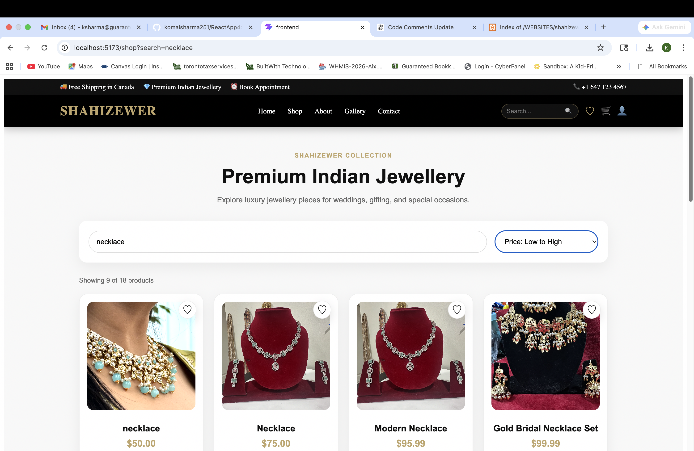
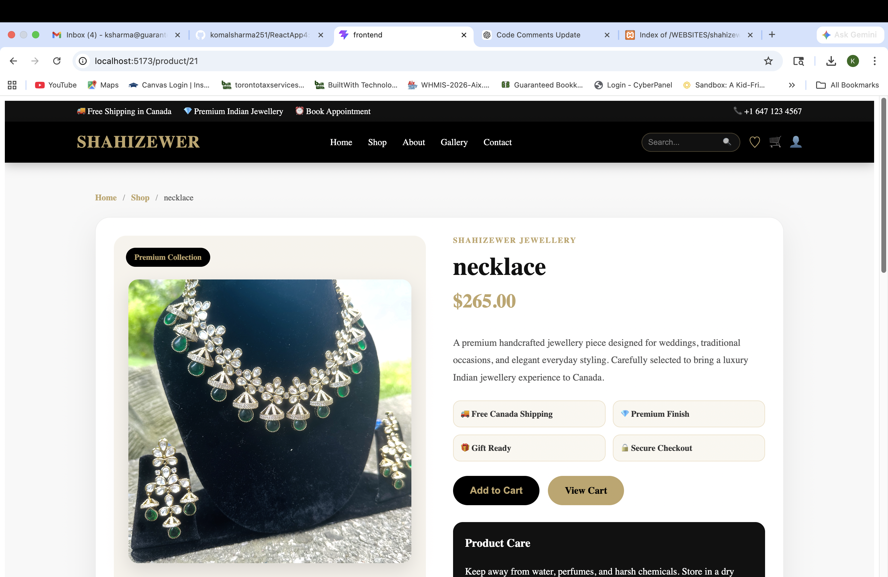
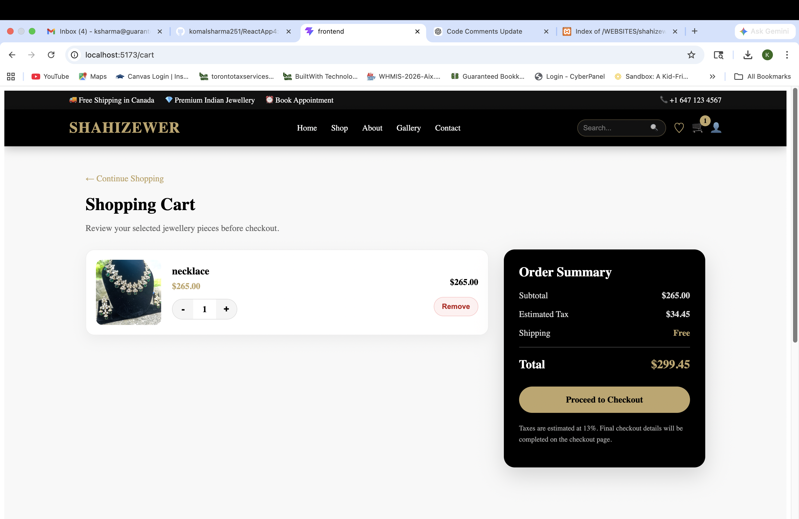
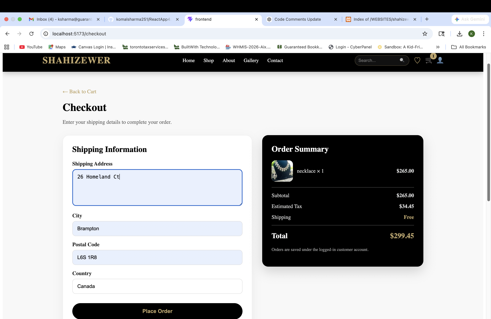
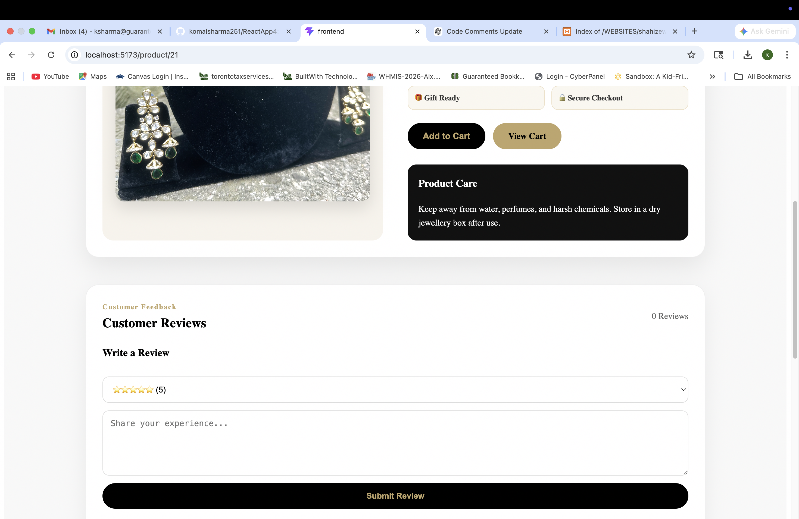
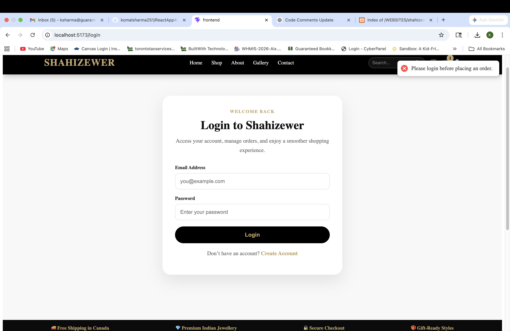
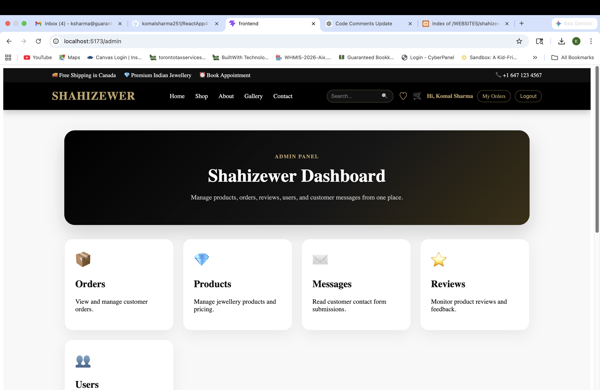
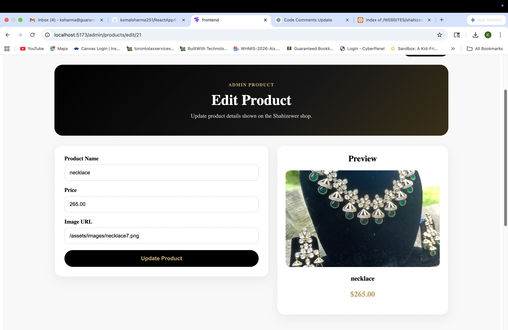
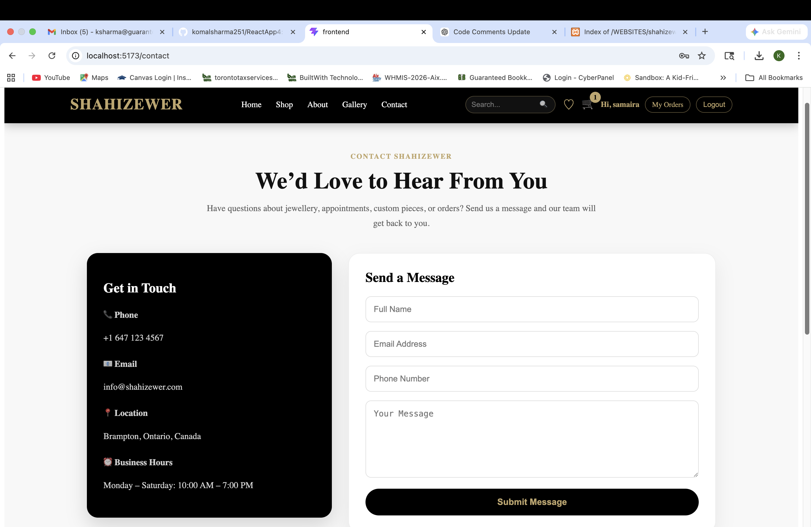

# 💎 Shahizewer – Full Stack Jewellery Ecommerce Platform

## 📌 Project Overview
Shahizewer is a modern full-stack ecommerce jewellery platform built using React, TypeScript, PHP, MySQL, and REST APIs. The platform allows customers to browse jewellery products, manage carts and wishlists, place orders, submit reviews, and manage their accounts.

The project also includes a complete admin dashboard where administrators can manage products, orders, customer inquiries, and reviews.

This project was designed with a professional ecommerce architecture and responsive UI/UX principles.

---

# 🚀 Live Features

## 👤 Customer Features

### 🏠 Modern Ecommerce Landing Page
- Professional jewellery-focused homepage
- Responsive premium UI
- Hero section with CTA
- Featured product sections
- Responsive navigation

### 🛍 Product Shopping System
- Product listing page
- Product detail page
- Dynamic products from MySQL database
- Product search functionality
- Wishlist functionality
- Product reviews system

### ❤️ Wishlist System
- Add/remove products to wishlist
- Persistent localStorage wishlist
- Wishlist icon integration

### 🛒 Cart & Checkout
- Add to cart
- Update cart quantity
- Remove items from cart
- Cart persistence using localStorage
- Checkout form
- Order creation API
- Customer order history

### 🔐 Authentication System
- User registration
- User login
- Role-based authentication
- Admin/customer roles
- Persistent login sessions

### 📦 Orders System
- Place orders
- View personal orders
- Shipping details
- Order tracking status

### ⭐ Product Reviews
- Submit product reviews
- Product rating system
- Reviews linked to products
- Reviews displayed dynamically

### 📱 Responsive UI
- Mobile responsive design
- Tablet responsive layout
- Hamburger navigation menu
- Responsive ecommerce cards
- Responsive admin dashboard

---

# 🛠 Admin Dashboard Features

## 👑 Admin Authentication
- Protected admin routes
- Role-based admin access
- Secure admin-only pages

## 📊 Admin Dashboard
- Central admin panel
- Navigation to management sections
- Ecommerce admin layout

## 📦 Orders Management
- View all customer orders
- Update order statuses
- Processing/shipped/delivered tracking
- Order management system

## 💎 Products Management (Full CRUD)

### ✅ Create Product
- Add new jewellery products
- Product image support
- Price management

### ✅ Read Products
- View all products
- Product cards with previews

### ✅ Update Product
- Edit existing products
- Live product preview
- Update price/name/image

### ✅ Delete Product
- Delete products safely
- Admin delete controls

## 📩 Contact Messages Management
- View customer inquiries
- Contact form integration
- Reply/call actions

## ⭐ Reviews Moderation
- View customer reviews
- Delete inappropriate reviews
- Product review monitoring

---

# 🧰 Tech Stack

## Frontend
- React
- TypeScript
- React Router DOM
- React Hot Toast
- CSS-in-JS (inline styling)
- Responsive Flexbox/Grid layouts

## Backend
- PHP 8
- REST APIs
- JSON API architecture
- MySQL
- PDO (secure database queries)

## Database
- MySQL Database
- Products table
- Users table
- Orders table
- Order items table
- Reviews table
- Contact messages table

## Development Tools
- Vite
- XAMPP
- VS Code
- phpMyAdmin
- Git & GitHub

---

# 📂 Project Structure

```bash
src/
 ├── components/
 │    ├── Header.tsx
 │    └── Footer.tsx
 │
 ├── pages/
 │    ├── HomePage.tsx
 │    ├── ProductList.tsx
 │    ├── ProductDetail.tsx
 │    ├── CartPage.tsx
 │    ├── CheckoutPage.tsx
 │    ├── LoginPage.tsx
 │    ├── RegisterPage.tsx
 │    ├── WishlistPage.tsx
 │    ├── MyOrdersPage.tsx
 │    ├── ContactPage.tsx
 │    ├── GalleryPage.tsx
 │    ├── AboutPage.tsx
 │    │
 │    └── admin/
 │         ├── AdminDashboard.tsx
 │         ├── AdminOrdersPage.tsx
 │         ├── AdminProductsPage.tsx
 │         ├── AdminAddProductPage.tsx
 │         ├── AdminEditProductPage.tsx
 │         ├── AdminMessagesPage.tsx
 │         └── AdminReviewsPage.tsx
 │
 └── └── App.tsx
```

 # 🗄 Database Tables

## Users
- user_id
- full_name
- email
- password
- role

## Products
- product_id
- product_name
- price
- image_url
- created_at

## Orders
- order_id
- user_id
- total_amount
- status
- shipping details

## Order Items
- order_item_id
- order_id
- product_id
- quantity
- price

## Reviews
- review_id
- product_id
- user_id
- customer_name
- rating
- review_text

## Contact Messages
- message_id
- name
- email
- phone
- message

---

# 🔌 API Endpoints

## Authentication APIs
- `/api/auth/login.php`
- `/api/auth/register.php`

## Products APIs
- `/api/products/list.php`
- `/api/products/get.php`

## Orders APIs
- `/api/orders/create.php`
- `/api/orders/list.php`

## Reviews APIs
- `/api/reviews/create.php`
- `/api/reviews/list.php`

## Contact APIs
- `/api/contact/create.php`

## Admin APIs
- `/api/admin/orders/list.php`
- `/api/admin/orders/update-status.php`
- `/api/admin/products/list.php`
- `/api/admin/products/create.php`
- `/api/admin/products/update.php`
- `/api/admin/products/delete.php`
- `/api/admin/messages/list.php`
- `/api/admin/reviews/list.php`
- `/api/admin/reviews/delete.php`

---

# 🎨 UI/UX Features

- Premium jewellery ecommerce design
- Gold + black luxury theme
- Modern admin dashboard UI
- Responsive ecommerce layouts
- Premium buttons/cards
- Toast notifications
- Sticky responsive header
- Mobile hamburger navigation
- Product image previews

---

# ⚡ Stretching Goals / Future Improvements

## 📷 Real Image Upload System
Allow admins to upload product images directly instead of manually entering image URLs.

## 📦 Inventory & Stock System
- Stock quantity
- In-stock/out-of-stock labels
- Low stock alerts

## 🏷 Featured Products System
Allow admins to mark products as featured for homepage display.

## 📊 Analytics Dashboard
- Total sales
- Total customers
- Revenue charts
- Top-selling products
- Order analytics

## 💳 Stripe Payment Integration
Real payment gateway integration.

## 📧 Email Notification System
- Order confirmation emails
- Contact form notifications
- Admin alerts

## 🚚 Shipping Calculator
Province-based shipping system.

## 🖼 Multiple Product Images
Product gallery sliders and zoom functionality.

## 🔎 Advanced Filtering
- Category filters
- Price filters
- Sorting options

## 🌎 Deployment Goals
- Deploy frontend
- Deploy PHP APIs
- Deploy MySQL database
- Production hosting

---

## 🎥 Project Demo

[Watch Demo Video](https://youtu.be/GU8ZvMikO98)

# 📸 Screenshots

---

# Customer Side

## 🏠 Homepage


---

## 🛍 Product Listing


---

## 📦 Product Details


---

## 🛒 Cart Page


---

## 💳 Checkout Page


---

## ⭐ Customer Reviews


---

## 🔐 User Login


---

# Admin Side

## 📊 Admin Dashboard


---

## ➕ Add Products


---

## ✏️ Edit Products


---

## 📦 Products Management


---

# Contact Page

## 📩 Contact Form

---

# 🧠 Learning Outcomes

Through this project I learned:

- Full-stack ecommerce architecture
- REST API development with PHP
- MySQL database integration
- Authentication systems
- CRUD operations
- Admin dashboard development
- Responsive frontend design
- State management in React
- Role-based access control
- Ecommerce workflows

---

# 👨‍💻 Author

Komal Sharma

Full Stack Web Developer Intern

---

# 📄 License

This project was created for educational and portfolio purposes.
